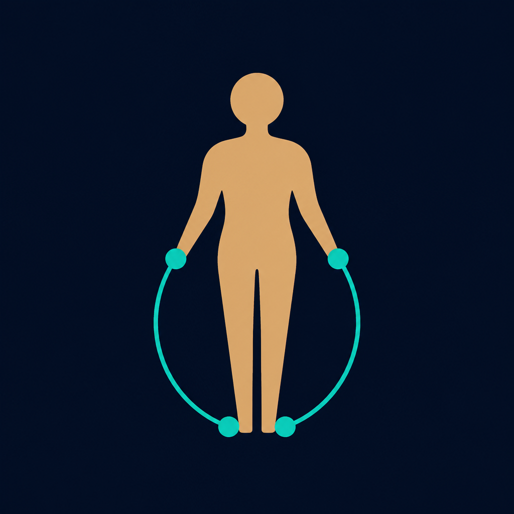

# Antropometria BIA

Strumento **locale** di antropometria e BIA/BIVA per la composizione corporea, su Windows.

[](LICENSE)
[](https://github.com/danielegabrovec/antropometria-bia/releases)
[](https://github.com/danielegabrovec/antropometria-bia/releases)

<p align="center">
  
</p>

**Autore:** [Daniele Gabrovec](https://github.com/danielegabrovec) — Biologo Nutrizionista (Ordine dei Biologi del Triveneto n. TRI_A2489).

> **Non è un dispositivo medico.** Non è marcato CE/FDA, non diagnostica e non sostituisce uno strumento BIA certificato, la plicometria ISAK, la densitometria o il giudizio clinico. Le formule sono stime di letteratura, ciascuna con una popolazione e una finestra di età.

## Cosa fa

- **Antropometria** — pliche Jackson-Pollock 3/4/7 e Durnin-Womersley, Siri/Brozek, circonferenze, BMI, WHR, WHtR, artometria, Heymsfield, Heath-Carter, omini fotografici uomo/donna/neutro con pin e heat.
- **BIA/BIVA** — profilo AKERN 101 (R + Xc, 50 kHz total-body): Sun, Janssen, Sergi, vettore R/H × Xc/H con ellissi Campa. BCM solo se lo inserisci dallo strumento.
- **Statistiche** — andamenti anche con una visita, Δ unico (precedente o prima), pendenza, Bland-Altman pliche vs BIA.
- **Report** — anteprima, PDF A4, CSV. Tutto gira in locale: nessun account, nessun cloud.

## Installazione (Windows)

1. Apri la pagina [Releases](https://github.com/danielegabrovec/antropometria-bia/releases).
2. Scarica `Antropometria-BIA-Setup-1.0.0.exe` (installer NSIS, 64 bit).
3. Esegui il file (lingua italiana, si può scegliere la cartella).
4. All’avvio accetta l’avvertenza.

### SmartScreen

L’installer **non è firmato con un certificato Authenticode a pagamento**. Windows può mostrare «Windows ha protetto il PC». Scegli **Ulteriori informazioni** → **Esegui comunque**.

### Disinstallazione

Impostazioni Windows → App → Antropometria BIA → Disinstalla. I JSON restano in `%APPDATA%\antropometria-bia` finché non li cancelli a mano.

Requisiti: Windows 10 o 11, 64 bit.

## Avvio da codice

Serve [Node.js](https://nodejs.org/) 20 o successivo.

```powershell
git clone https://github.com/danielegabrovec/antropometria-bia.git
cd antropometria-bia
npm install
npm test
npm run dev
```

| Comando | Cosa fa |
|---|---|
| `npm run dev` | App Electron in sviluppo |
| `npm test` | Suite Vitest del motore clinico |
| `npm run build` | Bundle in `out/` |
| `npm run dist` | Bundle + installer NSIS in `release/` |

## Layout

Rail a sinistra (come Kinetica, suite sorella). In **Misura**: profili e visite | omini fronte/retro | ispettore del pin e blocco BIA. Peso e altezza si scrivono una volta: antropometria e BIA non si fondono sui KPI.

## Motore

Porte da `@nutriva/clinical` (Sun 2003, Janssen 2000, Sergi, Jackson-Pollock, Durnin-Womersley, Gallagher 2000, BIVA Campa). Fuori dalla finestra di età il numero può uscire con riserva. Sesso «Altro» non viene convertito in maschio.
